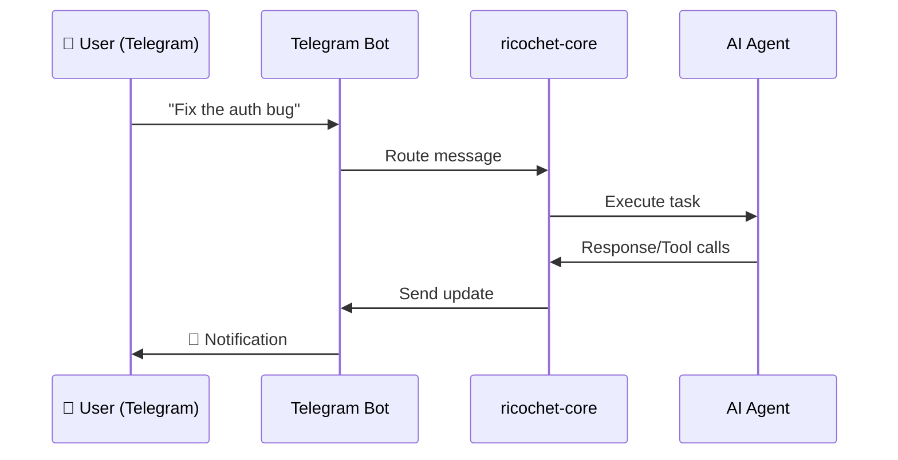

# Ricochet

<p align="center">
  <strong>🚀 AI Coding Agent with Live Mode — Control from Telegram/Discord</strong>
</p>

<p align="center">
  <a href="https://marketplace.visualstudio.com/items?itemName=ricochet.ricochet"></a>
  <a href="https://goreportcard.com/report/github.com/Grik-ai/ricochet"></a>
  <a href="https://opensource.org/licenses/Apache-2.0"></a>
  
</p>

<p align="center">
  <a href="#-features">Features</a> •
  <a href="#-live-mode">Live Mode</a> •
  <a href="#-installation">Installation</a> •
  <a href="#-architecture">Architecture</a>
</p>

---

Ricochet is the first hybrid coding agent that lives in your IDE and your pocket. Code autonomously with a powerful VS Code assistant, then switch to Ether Mode to control your development environment remotely via messenger. Build, debug, and deploy from anywhere.

## ✨ Features

### Core Capabilities

| Feature | Description |
|---------|-------------|
| **⚡ Live Mode (Ether)** | Control your AI agent via Telegram or Discord when AFK |
| **🎙️ Voice Commands** | Speak to your agent using Whisper STT integration |
| **📊 Diff View** | Preview changes before applying with inline diff |
| **🔄 Auto-Approval** | Skip confirmations for safe read operations |
| **🛡️ Checkpoints** | Git-based snapshots with one-click restore |
| **🎭 Custom Modes** | Data-driven personas (Architect, Coder, Reviewer) |
| **🔌 MCP Hub** | Dynamic tooling via Model Context Protocol |
| **🌙 Multi-Provider** | 7 AI providers with dynamic model picker |
| **💬 Multi-Session** | Run multiple concurrent agent conversations |
| **🌍 Cross-Platform** | macOS, Linux, Windows binaries bundled |

### IDE Support

- ✅ **VSCode** — Full support
- ✅ **Cursor** — Full support (VSCode fork)
- ✅ **Windsurf** — Full support (VSCode fork)
- 🔜 **JetBrains** — Coming soon

### AI Providers (BYOK — Bring Your Own Key)

| Provider | Models | Free Tier |
|----------|--------|----------|
| **Google Gemini** | Gemini 3 Flash, Gemini 3 Pro | ✅ 1500 req/day |
| **Anthropic** | Claude Sonnet 4, Opus 4 | ❌ |
| **OpenAI** | GPT-4o, o1 | ❌ |
| **xAI** | Grok 4, Grok Code Fast | ❌ |
| **DeepSeek** | DeepSeek Chat, Coder | ❌ (cheapest!) |
| **MiniMax** | M2.1, Text-02 (1M ctx) | ❌ |
| **OpenRouter** | 500+ models | Varies |

---

## 📱 Live Mode

Ricochet's **killer feature** — continue working with your AI agent from your phone.



### Ether Stages

When Live Mode is active, the UI shows real-time activity:

| Stage | Icon | Description |
|-------|------|-------------|
| `idle` | 🔵 Pulse | Waiting for input |
| `receiving` | 📥 | Message arriving from messenger |
| `processing` | ⚡ Spin | Agent is working |
| `responding` | 📤 | Sending reply |

Messages from Telegram appear in chat with a 📱 badge.

### Setup

1. Create a Telegram bot via [@BotFather](https://t.me/BotFather)
2. Get your Chat ID via [@userinfobot](https://t.me/userinfobot)
3. Enter credentials in Ricochet Settings
4. Toggle **Live Mode** ON

---

## � Installation

### From Marketplace (Recommended)

```bash
# VSCode / Cursor / Windsurf
ext install ricochet.ricochet
```

### From Source

```bash
# Clone repository
git clone https://github.com/Grik-ai/ricochet.git
cd ricochet

# Install dependencies
cd extension-vscode && npm install
cd ../webview && npm install

# Build everything
./scripts/build-all.sh

# Launch in dev mode (VSCode)
cd extension-vscode && npm run watch
# Press F5 to launch Extension Development Host
```

---

## 🏗️ Architecture

Ricochet follows a **modular sidecar architecture** for maximum performance and maintainability.

```
┌─────────────────────────────────────────────────────────────┐
│                    VSCode Extension                         │
│  ┌───────────────┐    ┌──────────────────────────────────┐ │
│  │ extension.ts  │◄──►│          Webview (React)         │ │
│  │ core-process  │    │  ChatView, Settings, LiveMode    │ │
│  └───────┬───────┘    └──────────────────────────────────┘ │
└──────────┼──────────────────────────────────────────────────┘
           │ JSON-RPC (stdio)
           ▼
┌─────────────────────────────────────────────────────────────┐
│                   ricochet-core (Go)                        │
│  ┌─────────────┬─────────────┬─────────────┬─────────────┐ │
│  │   Agent     │   Tools     │    MCP      │  Live Mode  │ │
│  │ Controller  │  Executor   │    Hub      │ Controller  │ │
│  └─────────────┴─────────────┴─────────────┴─────────────┘ │
│  ┌─────────────┬─────────────┬─────────────┬─────────────┐ │
│  │  Safeguard  │   Modes     │   Config    │   Bridge    │ │
│  │ Checkpoints │  Manager    │   Store     │   (Cloud)   │ │
│  └─────────────┴─────────────┴─────────────┴─────────────┘ │
└─────────────────────────────────────────────────────────────┘
```

### Project Structure

```
Ricochet/
├── extension-vscode/          # VSCode extension (TypeScript)
│   ├── src/
│   │   ├── extension.ts       # Entry point (~55 lines)
│   │   ├── core-process.ts    # Sidecar lifecycle
│   │   └── webview-provider.ts
│   ├── bin/                   # Cross-platform binaries
│   │   ├── darwin-arm64/
│   │   ├── darwin-x64/
│   │   ├── linux-x64/
│   │   └── win32-x64/
│   └── package.json

├── webview/                   # React UI
│   ├── src/
│   │   ├── components/
│   │   │   ├── chat/          # ChatView, Messages, Input
│   │   │   ├── live-mode/     # LiveModeSwitch, Status
│   │   │   └── settings/      # Settings panel
│   │   └── hooks/
│   │       ├── useChat.ts
│   │       ├── useLiveMode.ts
│   │       └── useAudioRecorder.ts
│   └── package.json

├── core/                      # Go backend
│   ├── cmd/
│   │   ├── ricochet/          # Main binary
│   │   └── eval/              # Evaluation runner
│   └── internal/
│       ├── agent/             # AI orchestration
│       ├── tools/             # Native tool implementations
│       ├── mcp/               # MCP Hub & OAuth
│       ├── modes/             # Custom agent personas
│       ├── safeguard/         # Checkpoints & permissions
│       ├── config/            # Settings persistence
│       ├── context/           # Tree-sitter parser
│       ├── livemode/          # Telegram/Discord control
│       ├── whisper/           # Voice transcription
│       └── bridge/            # Cloud WebSocket (yamux)

└── scripts/
    └── build-all.sh           # Cross-compile script
```

---

## � Core Modules

### Agent (`internal/agent/`)
- `controller.go` — Session & conversation management
- `anthropic.go` / `openai.go` — Provider implementations
- `state.go` — Thread-safe message handling

### Tools (`internal/tools/`)
- `executor.go` — Native tool dispatcher
- `fs_tools.go` — File system operations with consent
- `cmd_tools.go` — Command execution
- `browser_tools.go` — Chromedp integration

### MCP Hub (`internal/mcp/`)
- `hub.go` — Multi-server connection manager
- `oauth.go` — OAuth2 token management
- `config.go` — `mcp_settings.json` parser

### Modes (`internal/modes/`)
- `manager.go` — Hot-reloading mode configuration
- `types.go` — Mode schema (roles, restrictions, tool groups)

### Safeguard (`internal/safeguard/`)
- `manager.go` — Shadow git checkpoints
- `permissions.go` — "Always Allow" rule persistence

### Context (`internal/context/`)
- `treesitter.go` — Multi-language AST parsing (JS/TS/Python/Rust)
- `parser/` — Native Go AST for `.go` files
- `tracker.go` — Environment & file context injection

### Config (`internal/config/`)
- `store.go` — `~/.ricochet/settings.json` management

### Live Mode (`internal/livemode/`)
- `controller.go` — Telegram/Discord bot orchestration

---


## ⚙️ Configuration

### Settings Persistence

All settings are stored in `~/.ricochet/`:

| File | Purpose |
|------|---------|
| `settings.json` | API keys, provider config, Live Mode |
| `permissions.json` | "Always Allow" tool/path rules |
| `mcp_tokens.json` | OAuth tokens for MCP servers |
| `sessions/` | Persistent session history |

### Custom Modes

Create `.ricochet/modes.yaml` in your project:

```yaml
modes:
  - slug: qa
    name: QA Engineer
    roleDefinition: "Expert in testing and quality assurance"
    customInstructions: "Focus on edge cases and test coverage"
    groups:
      - read
      - edit:[**/*_test.go, **/*.spec.ts]
      - command
```

### MCP Settings

Compatible with Cline's format — `mcp_settings.json`:

```json
{
  "mcpServers": {
    "filesystem": {
      "command": "npx",
      "args": ["-y", "@modelcontextprotocol/server-filesystem", "/path"]
    },
    "github": {
      "command": "npx",
      "args": ["-y", "@modelcontextprotocol/server-github"],
      "env": { "GITHUB_TOKEN": "..." }
    }
  }
}
```

---


## 🛠️ Development

### Build Commands

```bash
# Build Go core (current platform)
cd core && go build ./cmd/ricochet

# Build all platforms
./scripts/build-all.sh

# Run evals
cd core && go run ./cmd/eval cases/

# Watch webview
cd webview && npm run dev

# Watch extension
cd extension-vscode && npm run watch
```

### Testing

```bash
# Go tests
cd core && go test ./...

# Webview tests
cd webview && npm test

# Extension tests
cd extension-vscode && npm test
```

---

## ❤️ Support the Project

Ricochet is an independent open-source project maintained by **Igor Pryimak**. 
I apologize for asking, but without your help, it will be very difficult to maintain and develop this project further.
If this tool helps you code faster and you want to support existing development, you can:

- ⭐ **Star** [the repo](https://github.com/Grik-ai/ricochet) (it really helps!)
- ☕ **Buy me a coffee (Ko-fi)**: [ko-fi.com/igoryan34](https://ko-fi.com/igoryan34)
- � **PayPal**: [Donate via PayPal](https://www.paypal.com/ncp/payment/PPMFBMFVAB8QN)
- �💎 **Crypto Support**:
  - **TON**: `UQB93GTsF6ZI7ljBViLr-IHIf93HpqwolC51jR5Und7GAwm4`
  - **USDT (TRC20)**: `TH1ZvpbmNKtArQ2zNyoeAq4zvU3koNTFhj`
  - **EVM (BNB / USDT / BTC - BEP20)**: `0x048911b8690cd7c85a0898dffbd5e3b9ba50dd10`
  - **Bitcoin (BTC)**: `13fC3C2yRq4i8meaUqHWK6H5UQ2V1Bk8Ct`

## 📄 License

Apache 2.0 © 2025 Igor Pryimak, TK BAZIS - M / GRIK - AI

---

<p align="center">
  <strong>Built with ❤️ for developers who want to code even from their couch</strong>
</p>
